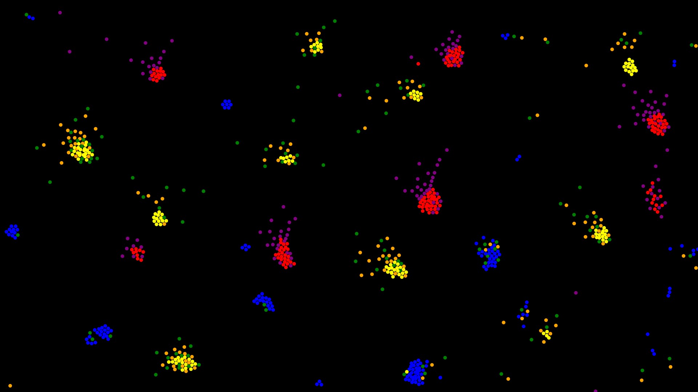
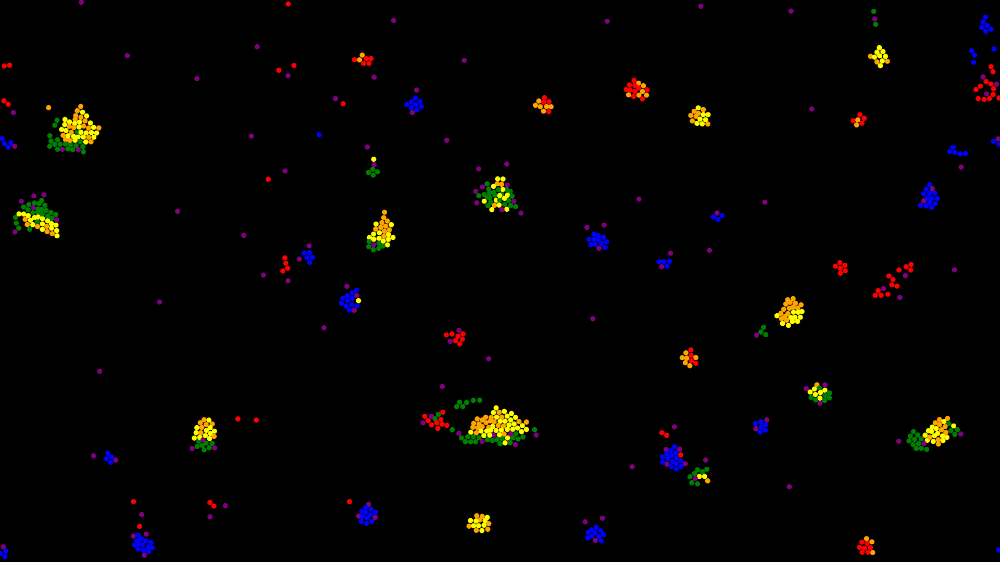
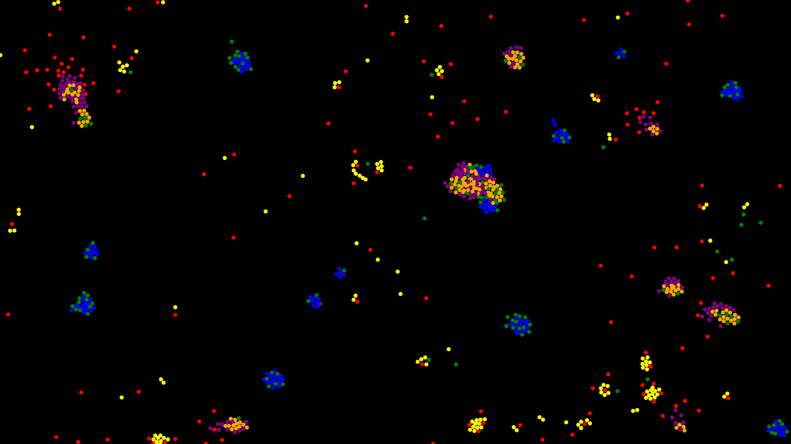
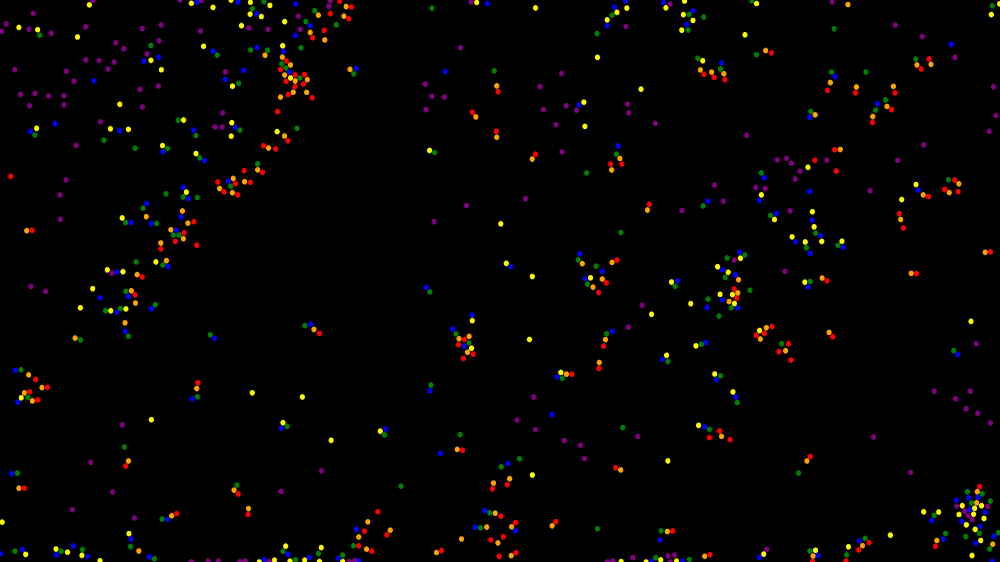

# Particle Life

Try the demo: [https://sam-martis.github.io/Particle_Life/](https://sam-martis.github.io/Particle_Life/)

Reload the page to get new interaction rules! New combinations every refresh!

This project has turned out better than I expected. 

At it's core, this is an attempt to simulate 'life'. Very basic and rudimentary life, but still life.

I find it to be a better representation of how protiens and enzymes work. Often times in the simulation, you'll see recombination happening. Sometimes adding a single particle to a collection/group will completely reorient and reshape it.

Also it's cool to look at, especially how complex structures form from simple rules of interaction.

## How it works
### Core idea:
Unsymmetric forces. That's what drives the entire simulation. Red could attract Green but Green could repel Red. If the stength of attraction/repulsion is similar, they could form a pair that makes movement, with one constantly trying to get away while the other gets tugged along!

We can represent the coefficient of attractions as a matrix $A$ of size $n$ x $n$
The ${A_{ij}}^{th}$ entry represents the co-efficient of attraction attraction of the $i^{th}$ particle type to the $j^{th}$ particle type.

For the above simulation, the number of types of particles(ie: $n$) is 6 (can be easily increased but I didn't feel the need to do it) 

The interaction matrix A is assigned random values at the beggining of each session. Hence, Whenever you refresh the page, you get new rules and new possibilities for structures to form!

### More details:

#### Quad trees
The core computational engine is powered by k-d trees, more specifically a Quad-tree in my case. k-d trees are spatial data-structures, as they encode information about the location of elements within their structure. 

This makes calculating forces more efficient as we can only query nearby particles of and ignore far-away particles. 

Also, collision detction is **GREATLY** improved as we can just query the immediate viscinity of the particle in question.

Check out my Quad tree implementation for more details!
[https://github.com/Sam-MARTis/QuadTrees](https://github.com/Sam-MARTis/QuadTrees)

#### Toroidal Boundry
A toroidal boundry is type of boundry condition where the entire map can be mapped onto a toroid, with the edges meeting. Basically, if you go far left, you emerge out of the right.
Not as simple to setup as I expected cause I also had to change the region to query the Quad tree at.

#### RK2 Method
A Runge-Kutta method of order 2 is used (Also known as Heun's method) to update the velocity given the forces.

## More pictures

